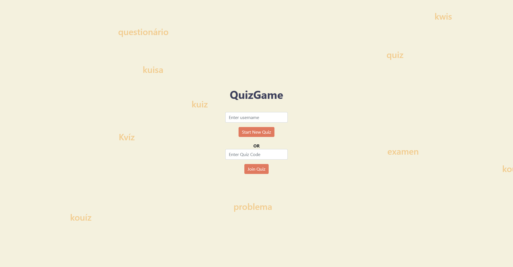

# QuizGame  

> This is a node.js QuizGame application powered by SocketIO (4.1.2)  and Express (4.17.1). 

## Casus
 
I started this project to get familiar with socket.io. Before this project I never used sockets and wanted to enlarge my scripting skills and get experience with socket.io. I chose to make a QuizGame to start easy and make something I enjoy to make and could learn from.

## Libraries

This project uses several npm libraries:
* [Socket.io](https://www.npmjs.com/package/socket.io)
* [Express](https://www.npmjs.com/package/express)
* [Nodemon](https://www.npmjs.com/package/nodemon)
* [Cors](https://www.npmjs.com/package/cors)

## Installation

In order to host the QuizGame and use it you need to execute several commands. 

### 1. Install required npm-packages

To make the github download as small as possible you need to download the npm packages needed by the node.js application locally. The required packages are listed in the package.json file.

Run the command `npm install package.json` to install the required packages.

### 2. Docker container setup 

After you installed the packages locally you can setup a docker container with the [docker-compose](docker-compose.yml) file that is listed above.

You can run the docker container by executing the following command in the directory where the docker-compose.yml file is located:
`docker-compose up`

<strong>NOTE:</strong> Remember to change the volume locations. And if needed change the ports but don't forget to also change the port in the [index.js](html/index.js) file.

### 3. Access the QuizGame

When the docker container is active, you can access the QuizGame by visiting `http://${ip}:1011/`. When the page is loaded you can start playing the QuizGame alone or with your friends.

There are several subjects you can choose from like geography, history, language, film and culture. You can also add your own questions to the [quizdata.js](server/quizdata.js) file.

<strong>NOTE:</strong> Don't forget to restart the docker container after changing the quizdata. Otherwise the new questions won't be loaded into the game.

## Acknowledgements

I started this project after getting inspired by two youtube videos. The first video I watched was about a snake game that used Socket IO. After watching that video I wanted to work on a project that involved sockets. The second video I got inspired with a idea on how i could use sockets within a project.

[Multiplayer Snake Game | JavaScript & SocketIO](https://www.youtube.com/watch?v=ppcBIHv_ZPs&list=LL&index=1) // by 
Traversy Media

[10 JavaScript Projects in 10 Hours - Coding Challenge 🔥](https://www.youtube.com/watch?v=dtKciwk_si4&t=3047s) // by Florin Pop

## Contact

Created by [@nbakkers](https://nbakkers.nl) - Feel free to contact me!